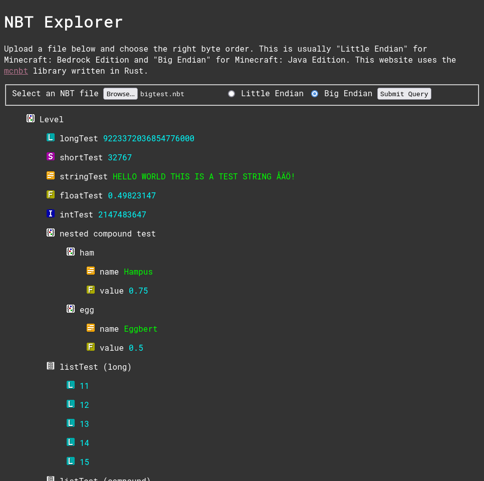

# mcnbt-web

A NBT explorer for the web which makes use of the [mcnbt] crate.

[](https://phoenixr-codes.github.io/mcnbt/)




## Build Manually

### Prerequisites

- [Rust]
- [`wasm-pack`]


### Build

```console
git clone https://github.com/phoenixr-codes/mcnbt.git
cd mcnbt/web
./build.sh
```


### Launch

Then run a server which serves the `site` directory by using a tool like [Python's `http.server`] or
[Vercel's `serve`]:

```console
python -m http.server -d site
# or
serve site
```

[mcnbt]: https://github.com/phoenixr-codes/mcnbt
[Python's `http.server`]: https://docs.python.org/3/library/http.server.html
[Rust]: https://www.rust-lang.org/tools/install
[Vercel's `serve`]: https://github.com/vercel/serve
[`wasm-pack`]: https://rustwasm.github.io/wasm-pack/installer/
